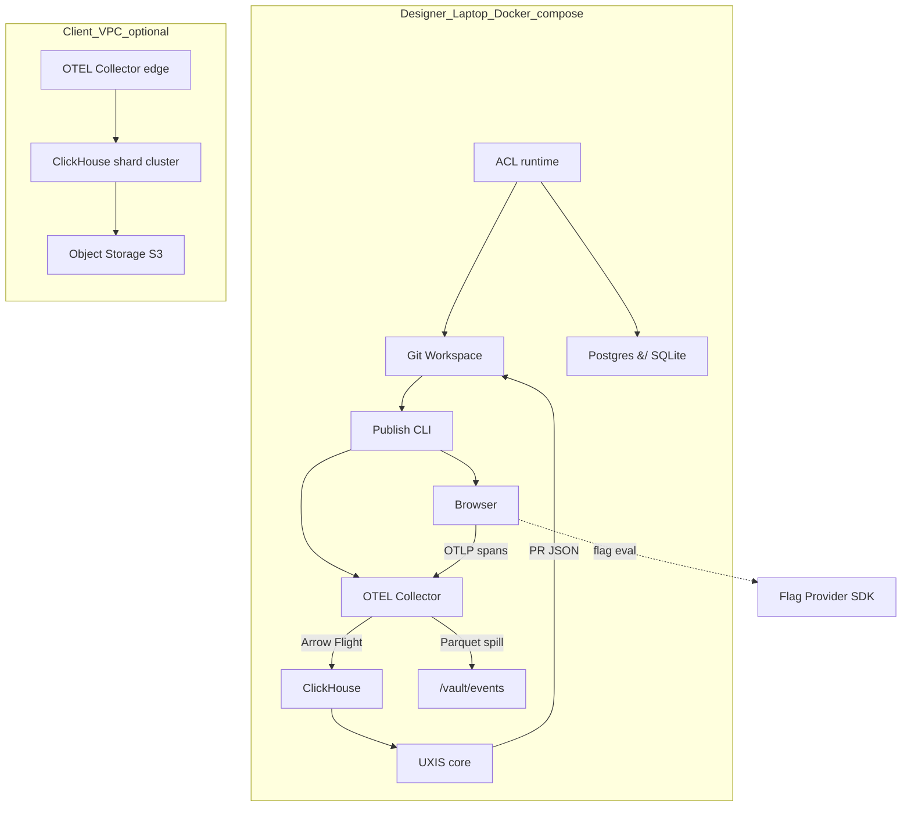

```mermaid
graph TD
  %% Designer workstation boundary
  subgraph Designer_Laptop_Docker_compose
    direction LR
    A1["ACL runtime"] --> A7["Git Workspace"]
    A1 --> DB1["Postgres &#47; SQLite"]
    A7 --> CE1["Publish CLI"]
    CE1 --> COL["OTEL Collector"]
    CE1 --> BROWSER["Browser"]
    BROWSER -->|OTLP spans| COL
    COL -->|Arrow Flight| CH["ClickHouse"]
    COL -- "Parquet spill" --> PV["/vault/events"]
    CH --> UXIS["UXIS core"]
    UXIS -->|PR JSON| A7
  end

  %% Optional cloud deployment
  subgraph Client_VPC_optional
    direction TB
    COLC["OTEL Collector edge"] --> CHC["ClickHouse shard cluster"]
    CHC --> S3["Object Storage S3"]
  end

  %% Shared flag provider outside laptop boundary
  BROWSER -. "flag eval" .-> FLAGSDK["Flag Provider SDK"]
```
