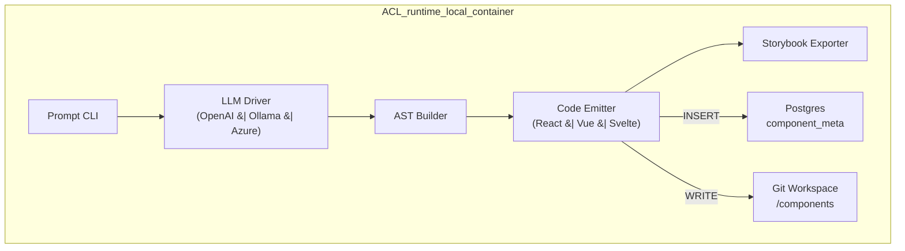

```mermaid
graph TD
  subgraph ACL_runtime_local_container
    A1["Prompt CLI"] --> A2["LLM Driver<br/>(OpenAI &#124; Ollama &#124; Azure)"]
    A2 --> A3["AST Builder"]
    A3 --> A4["Code Emitter<br/>(React &#124; Vue &#124; Svelte)"]
    A4 --> A5["Storybook Exporter"]
    A4 -- "INSERT" --> A6["Postgres<br/>component_meta"]
    A4 -- "WRITE"  --> A7["Git Workspace<br/>/components"]
  end
```
