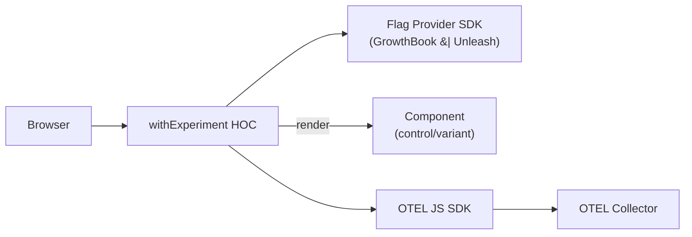

```mermaid
graph LR
  B1["Browser"] --> B2["withExperiment HOC"]
  B2 --> B3["Flag Provider SDK<br/>(GrowthBook &#124; Unleash)"]
  B2 -->|render| B4["Component<br/>(control/variant)"]
  B2 --> B5["OTEL JS SDK"]
  B5 --> B6["OTEL Collector"]
```
