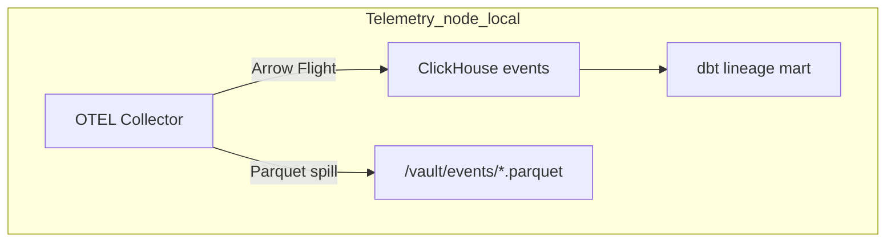

```mermaid
graph TD
  subgraph Telemetry_node_local
    C1["OTEL Collector"] -->|Arrow Flight| C2["ClickHouse events"]
    C1 -- "Parquet spill" --> C3["/vault/events/*.parquet"]
    C2 --> C4["dbt lineage mart"]
  end
```
