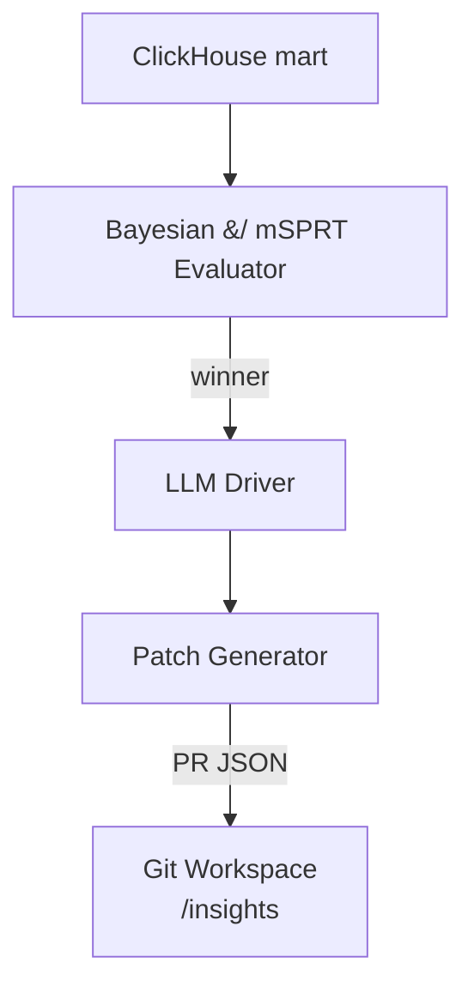

```mermaid
graph TD
  D1["ClickHouse mart"] --> D2["Bayesian &#47; mSPRT Evaluator"]
  D2 -->|winner| D3["LLM Driver"]
  D3 --> D4["Patch Generator"]
  D4 -- "PR JSON" --> D5["Git Workspace<br/>/insights"]
```
